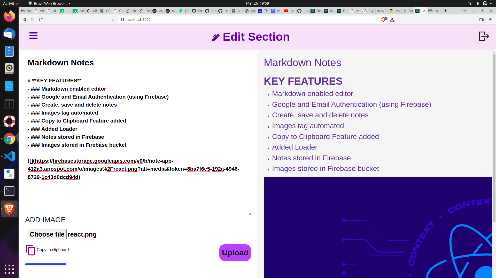
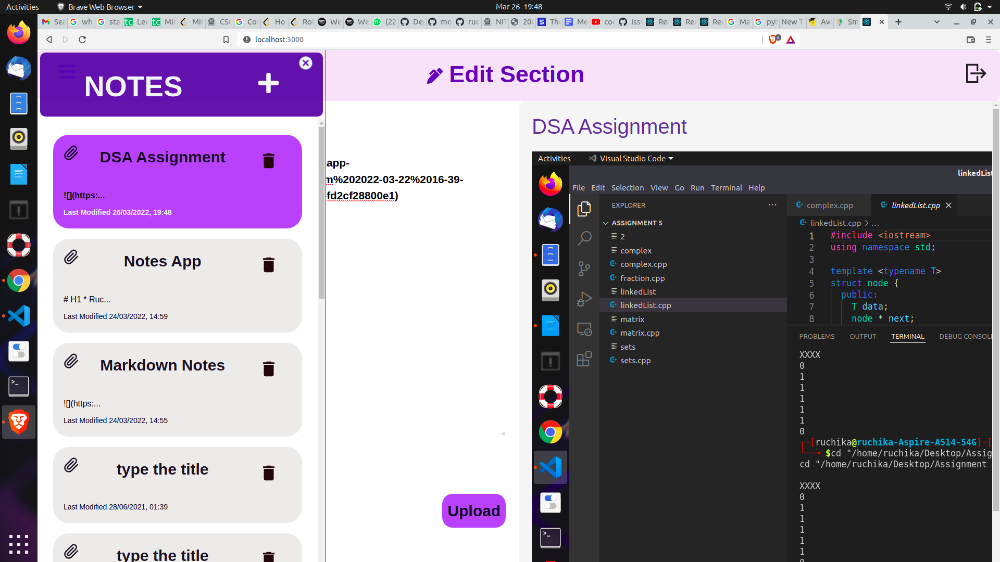
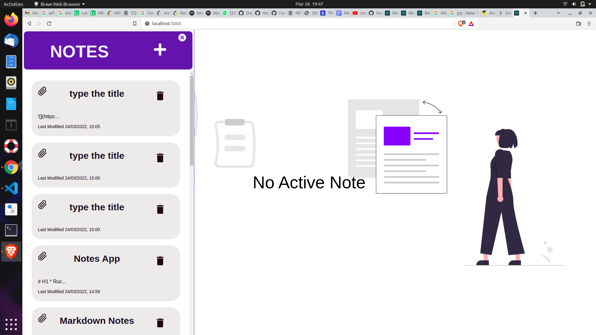
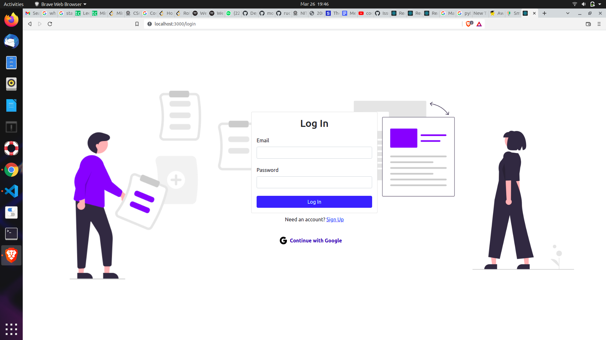

# NOTE APP
# </img> </img> </img>

## FRONTEND


<p>
                                    
 
 
 </p>

## Description

A markdown enabled user-specific notes app

# **KEY FEATURES**
- ### Markdown enabled editor
- ### Google and Email Authentication (using Firebase)
- ### Create, save and delete notes
- ### Images tag automated
- ### Copy to Clipboard Feature added
- ### Added Loader
- ### Notes stored in Firebase
- ### Images stored in Firebase bucket

## Installation and Usage

- Clone this repository
- Install all the dependencies by running this command

```
npm install
```

- create .env file and fill it up with required values from .env.example

- create a firebase project and add the necessary apis

- Run the development Server

```
npm start
```
